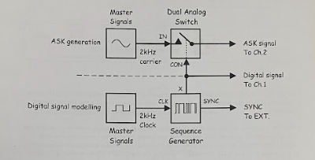
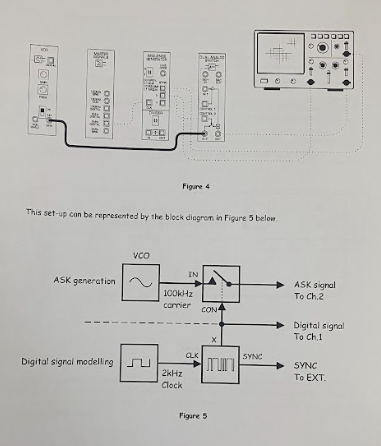
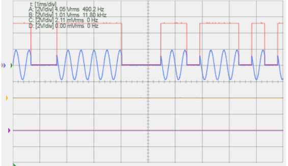
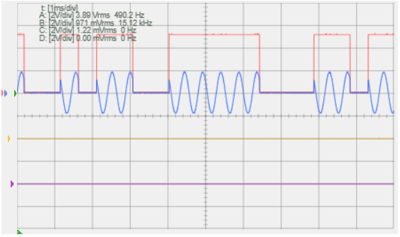
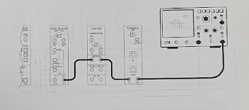
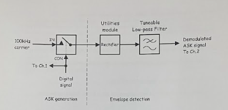

# LABREPORT-3
# PART A: DIGITAL PASSBAND MODULATION (ASK AND FSK)

# Amplitude Shift Keying (ASK) Simulation

This repository contains a Python implementation of **Amplitude Shift Keying (ASK)**, specifically focusing on the **On-Off Keying (OOK)** method. 

## AMPLITUDE SHIFT KEYING (ASK)

ASK is a digital modulation technique where the amplitude of a carrier wave is varied in response to a digital signal. In this simulation:
* **Generation:** Uses the "Switching Method" to gate a high-frequency sine wave.
* **Detection:** Implements **Asynchronous Envelope Detection** to recover the signal.
* **Noise:** Demonstrates signal integrity under varying Signal-to-Noise Ratio (SNR) conditions.

# Amplitude Shift Keying (ASK) Simulation & Hardware Implementation

This project documents the implementation of **Amplitude Shift Keying (ASK)**, specifically the **On-Off Keying (OOK)** method. It demonstrates a complete communication loop from generation via the "Switching Method" to recovery using an "Asynchronous Demodulation Chain."

---

## Technical Specifications

| Parameter | Specification |
| :--- | :--- |
| **Carrier Frequency ($f_c$)** | $100\text{ kHz}$ (Sine Wave) |
| **Message Frequency ($f_m$)** | $2\text{ kHz}$ (Digital Bitstream) |
| **Modulation Type** | Digital Passband (ASK/OOK) |
| **Detection Type** | Asynchronous Envelope Detection |

---

## Implementation Stages

### Generation (The Switching Method)
The transmitter uses a **Dual Analog Switch** to gate the carrier. The digital bitstream acts as the control signal:
* **Logic '1' (High):** Switch closes $\rightarrow$ Carrier passes to output.
* **Logic '0' (Low):** Switch opens $\rightarrow$ Output is $0\text{V}$.

### Recovery (The Demodulation Chain)
To restore the $2\text{ kHz}$ data at the receiver, a three-stage process is implemented:

**Rectification:** The bipolar ASK signal is passed through a **Utilities Module (Rectifier)** to convert it into a unipolar signal.
   
**Envelope Extraction:** A **Tuneable Low-Pass Filter (LPF)** is used to remove the $100\text{ kHz}$ carrier ripples, leaving the "envelope" of the original message.

**Decision Circuit (The Comparator):** Because the filtered signal suffers from **integration distortion** (rounded edges), it is passed through a **Comparator with a Variable DC Threshold**. This "squares up" the signal and restores sharp transitions.

---

## Key Performance Indicators
* **Threshold Calibration:** The **Variable DC Threshold** is critical for minimizing Bit Error Rate (BER) in noisy environments.
* **Filter Bandwidth:** The LPF must be tuned specifically to reject the $100\text{ kHz}$ carrier while preserving the $2\text{ kHz}$ message integrity.

---

  
 Wiring Diagram

  <!-- Images are located in the LABPICS directory -->
  
  
  
  
  

  
 Results

  <!-- Images are located in the LABPICS directory -->
  
  
  
  
  

---

# Frequency Shift Keying (FSK) Modulation & Demodulation

This section covers the implementation of **Frequency Shift Keying (FSK)**, a digital modulation scheme where the frequency of the carrier is shifted between two discrete values to represent binary data. This implementation utilizes a **Voltage Controlled Oscillator (VCO)** for generation and a **Zero-Crossing Detector (ZCD)** for asynchronous recovery.

---

## FSK Generation (VCO Switching)
The FSK signal is generated using a **Voltage Controlled Oscillator (VCO)** module. A $2\text{ kHz}$ digital bitstream is applied directly to the VCO's **DATA** input, causing the carrier to shift between two frequencies:

* **Logic '0' (Space):** The VCO outputs a lower carrier frequency ($f_1$).
* **Logic '1' (Mark):** The VCO outputs a higher carrier frequency ($f_2$).

This method ensures a continuous phase transition between symbols, effectively generating a **Continuous Phase FSK (CPFSK)** signal.

---

## Signal Recovery (Zero-Crossing Detection)
Demodulation is achieved through a **Zero-Crossing Detector (ZCD)** approach, which converts frequency variations into measurable DC voltage levels.

### Squaring & Pulse Generation
The incoming FSK signal is converted into a series of fixed-width pulses. 
* The circuit triggers a pulse at every **zero-crossing** of the carrier wave.
* Because the "Mark" frequency ($f_2$) has more cycles per second than the "Space" frequency ($f_1$), it produces a significantly **higher density of pulses** over the same time interval.

### Integration & Smoothing
The pulse train is fed into a **Tuneable Low-Pass Filter (LPF)** which acts as an integrator:
* **High Pulse Density ($f_2$):** Results in a higher average DC voltage at the filter output.
* **Low Pulse Density ($f_1$):** Results in a lower average DC voltage.
* **Result:** The filter effectively "traces" the pulse density, recreating the original $2\text{ kHz}$ square wave bitstream.

---

##  Technical Specifications

| Parameter | Value |
| :--- | :--- |
| **Bit Rate** | $2\text{ kbps}$ |
| **Modulation Method** | VCO-based Frequency Switching |
| **Demodulation Method** | Zero-Crossing Pulse Density Detection |
| **Recovery Logic** | Integration via Low-Pass Filtering |

---

  
 Wiring Diagram

  <!-- Images are located in the LABPICS directory -->
  
  
  
  
  

  
 Results

  <!-- Images are located in the LABPICS directory -->
  
  
  

